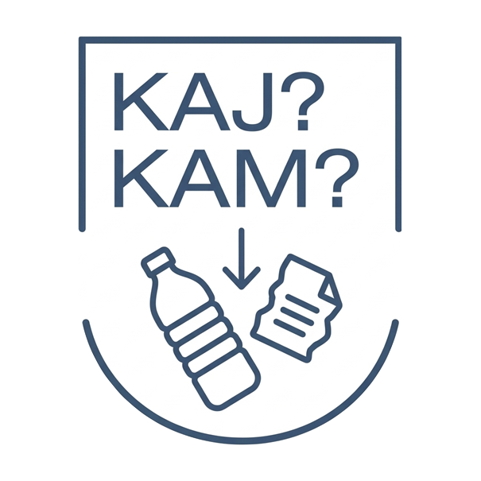

<div align="center">


# KAJ-KAM?

**Tvoj AI vodič za sortiranje otpada u Zagrebu**

*AI-powered waste management app helping Zagreb citizens properly sort and dispose of waste.*

</div>

---

## About

**KAJ-KAM?** ("Where to?" in Zagreb slang) is an AI-powered web app built for a hackathon. It uses Google Gemini AI to help citizens identify waste types, find the nearest bin, and earn rewards — all while providing valuable data to the city.

## Key Features

- **AI Scanner (Skener)** — Point your camera at waste → Gemini AI classifies it → shows the correct bin color + awards EkoBodovi points
- **Interactive Map (Karta)** — 2,523 Zagreb bin locations loaded from CSV, color-coded by waste type, with a "Report Full Bin" feature
- **Recycling Chatbot (ZG Eko-Asistent)** — Gemini-powered Q&A assistant for all recycling questions
- **Gamification (Moj Profil)** — EkoBodovi points, progress tracking, and redeemable rewards

## Project Structure

```
├── app/              # Main web application (React + Vite + TypeScript)
├── landing/          # Marketing landing page
├── prezentacija/     # Pitch deck / presentation
├── docs/             # Project spec & brand guidelines
└── logo/             # Brand assets
```

## Tech Stack

- **Frontend:** React 19, TypeScript 5.8, Vite 6
- **Styling:** TailwindCSS 4, Lucide React icons, Motion (Framer Motion)
- **AI:** Google Gemini API (`@google/genai`)
- **Data:** Papa Parse (CSV parsing for bin locations)

## Getting Started

**Prerequisites:** Node.js

```bash
# Main app
cd app && npm install && npm run dev

# Landing page
cd landing && npm install && npm run dev

# Presentation
cd prezentacija && npm install && npm run dev
```

The main app requires a `.env` file with `GEMINI_API_KEY`, `APP_URL`, `SUPABASE_URL`, `SUPABASE_PUBLIC_KEY`, and `SUPABASE_SECRET_KEY`.

## Design System

| Element | Value |
|---------|-------|
| **Primary** | ZG Blue `#004482` / `#005BAB` |
| **Accent** | ZG Red `#BB0400` / `#E10600` |
| **Waste colors** | Yellow (plastic), Blue (paper), Brown (bio), Green (glass), Dark Grey (mixed) |
| **Font** | Inter |
| **Layout** | Mobile-first, max 450px container |

See [`docs/brand_guideline.md`](docs/brand_guideline.md) for the full design reference.

---

<div align="center">

© 2026 KAJ-KAM? — Grad Zagreb Civic Tech Project

</div>
